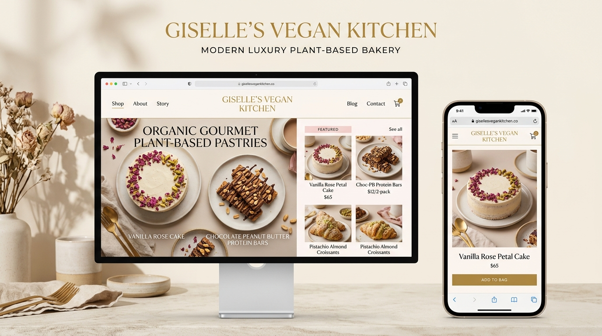
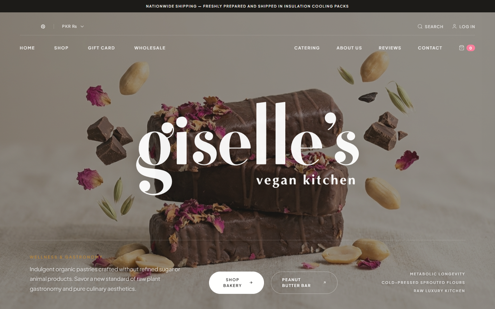
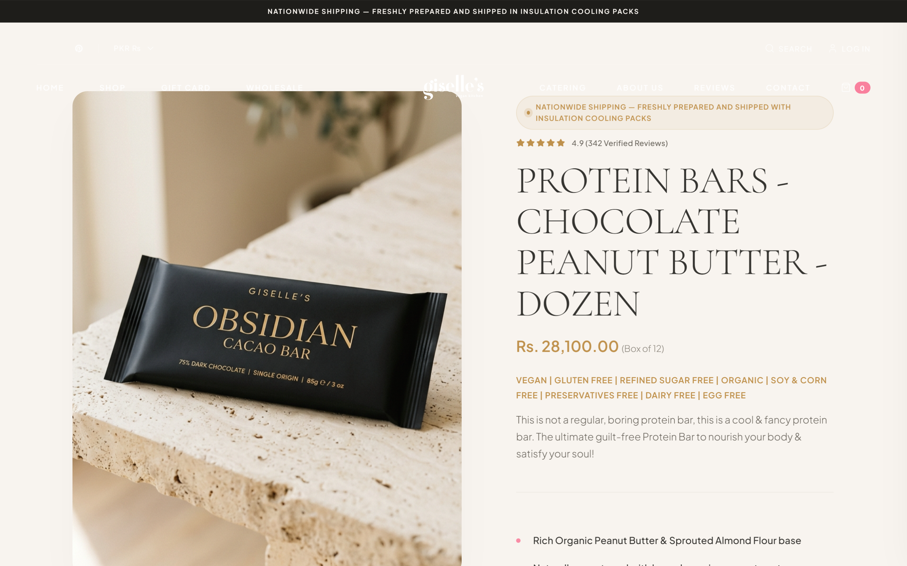
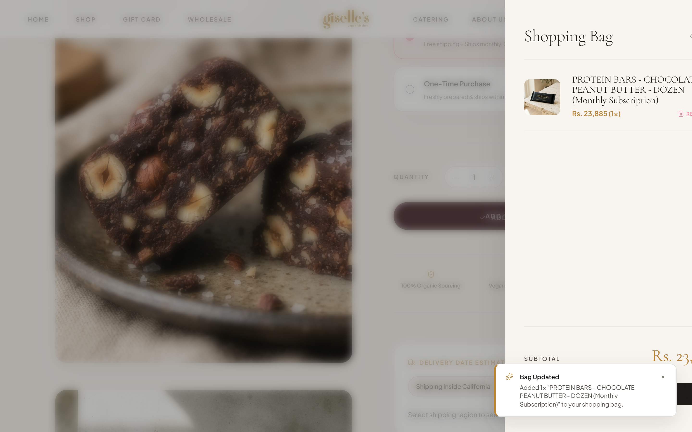
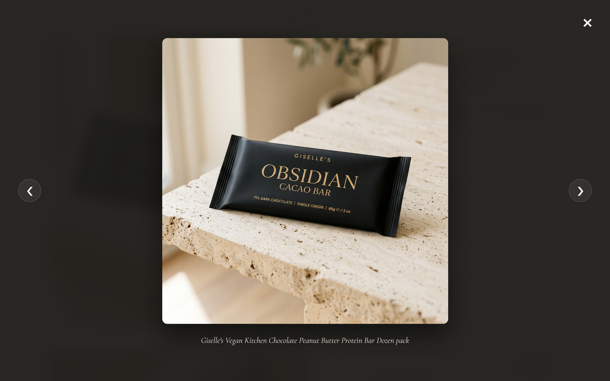
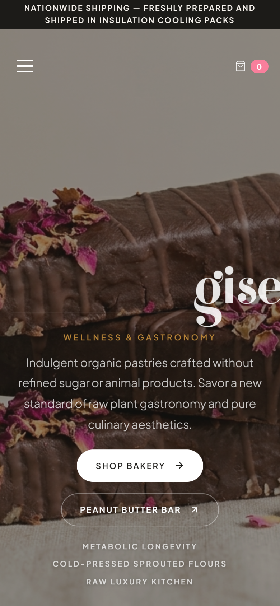
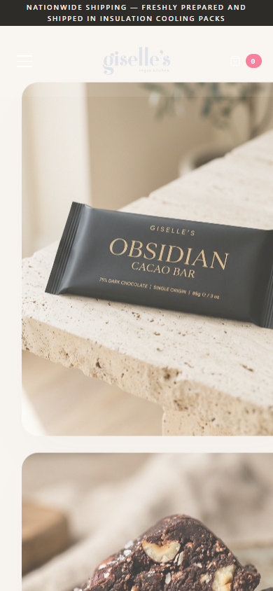
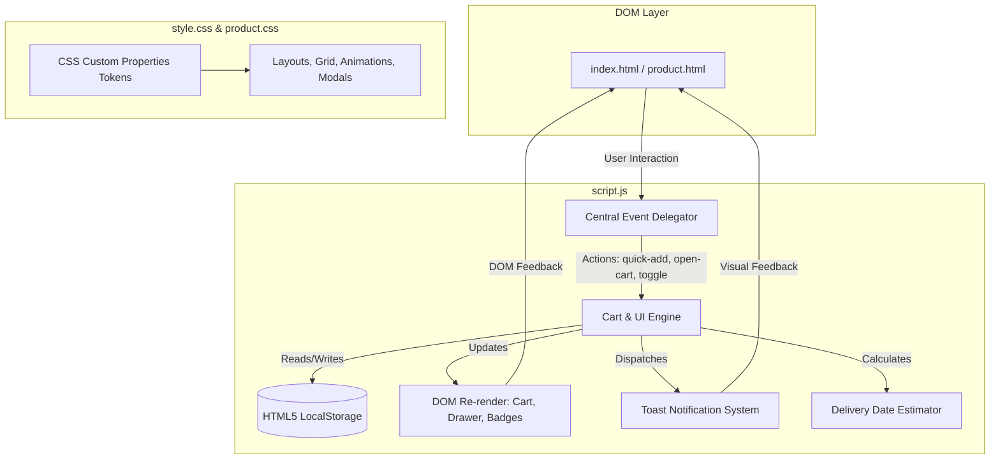

# Giselle's Concept

> A luxury organic wellness bakery e-commerce experience featuring artisanal plant-based pastries, responsive lookbook UI, interactive client-side shopping bag engine, and modern DTC design.

[](LICENSE)
[](https://developer.mozilla.org/en-US/docs/Web/JavaScript)
[](https://www.w3.org/WAI/standards-guidelines/wcag/)
[](https://github.com/sedmugen/giselles-concept/actions)
[](CONTRIBUTING.md)

---

## Visual Showcase



### Application Interface & Experience Gallery

| Desktop Storefront Lookbook | Product Detail & Customizer |
| :---: | :---: |
|  |  |

| Sliding Shopping Bag Drawer | High-Resolution Lightbox Modal |
| :---: | :---: |
|  |  |

| Mobile Responsive Storefront | Mobile Product Experience |
| :---: | :---: |
|  |  |

---

## Overview & Motivation

**Giselle's Concept** translates high-end gastronomic storytelling and metabolic wellness into an immersive digital Direct-to-Consumer (DTC) storefront. Developed as a flagship open-source frontend project, it reimagines the digital presence of [**Giselle's Vegan Kitchen**](https://www.gisellesvegankitchen.com) (Laguna Beach, CA) by transforming a standard retail storefront into an editorial, luxury lifestyle lookbook.

### The Re-imagination Concept
While the original reference site ([www.gisellesvegankitchen.com](https://www.gisellesvegankitchen.com)) operates on a traditional catalog e-commerce layout, this project re-architects the brand experience from the ground up:
* **Editorial Lookbook Storytelling**: Replaces cluttered grid blocks with expansive editorial whitespace, high-fashion serif typography (*Cormorant Garamond*), and interactive ingredient ledger accordions.
* **Modern DTC Micro-Interactions**: Introduces scroll-linked glassmorphism navigation, dynamic logo handoffs, 3-stage loading buttons, and texture zoom lightboxes.
* **Zero-Framework Performance**: Eliminates third-party app bloat and framework overhead with native semantic HTML5, CSS3 Custom Properties, and modular ES6+ JavaScript.

Key engineering goals:
* **Frameworkless Architecture**: High-performance, zero-dependency implementation utilizing pure semantic HTML5, CSS3 Custom Properties, and Vanilla ES6+ JavaScript.
* **Sensory Luxury Aesthetics**: Editorial design system inspired by minimalist lookbooks, leveraging balanced whitespace, bespoke typography (*Cormorant Garamond* & *Plus Jakarta Sans*), subtle micro-interactions, and glassmorphic navigation.
* **Conversion Rate Optimization (CRO)**: Practical e-commerce mechanics including dynamic subscription toggles, localized shipping estimators, multi-stage loading checkout triggers, and accessible modal drawers.

---

## Features

### 🌟 Storefront & Editorial Lookbook (`index.html`)
* **Dual-State Glassmorphism Header**: Floating translucent header with localized currency switcher, utility search/login triggers, and an automated logo reveal transitioning from hero backdrop to sticky navigation.
* **Layered Lookbook Hero**: High-impact editorial photography with dark scrim overlay, responsive fluid typography (`clamp()`), and brand manifesto.
* **Press & Accolades Trust Bar**: Minimalist social proof bar featuring *Vogue*, *Forbes*, *Erewhon*, and *Cereal*.
* **Signature Best Sellers Grid**: Interactive product cards with instant "Quick Add" actions.
* **Interactive Functional Ingredients Ledger**: Accordion explorer highlighting raw cacao, sprouted almonds, and coconut nectar with synchronized image pulse feedback.
* **Press Review Carousel**: Accessible multi-slide quote carousel with automatic 7-second rotation and manual dot navigation.
* **The Kitchen Ledger (Newsletter)**: High-converting capsule newsletter form with real-time feedback.

### 🛍️ Product Detail Page (`product.html`)
* **Split-Screen Layout Grid**: Scrolling vertical gallery stack paired with a sticky purchase and customization panel.
* **Fullscreen Texture Lightbox**: Modal dialog with keyboard navigation (`Escape`, `←`, `→`) allowing customers to inspect pastry textures.
* **Interactive Purchase Selector**: Dynamic radio selector allowing customers to choose between *One-Time Purchase* and *Subscribe & Save 15%* with instant price recalculation.
* **Dynamic Delivery Date Estimator**: Real-time delivery calculator accounting for regional California vs. out-of-state transit times and daily 11:00 AM PST cut-offs.
* **Multi-Stage "Add to Bag" Button**: Micro-interaction transitioning through *Normal* → *Loading Spinner* → *Success Checkmark* → *Auto-Drawer Open*.
* **Nutritional Highlights Grid**: Functional callout cards detailing plant-based, sugar-free, and organic sourcing.

### 🛒 Client-Side DTC Shopping Bag Engine (`script.js`)
* **Local Storage Persistence**: Cart state automatically syncs to browser `localStorage` under `giselles_cart`.
* **Sliding Bag Drawer**: Off-canvas sliding drawer with real-time subtotal calculation, item removal, and badge bump animations.
* **Luxury Toast Notification System**: Non-blocking toast notifications replacing disruptive browser alerts.
* **Accessible Dialog Management**: Keyboard focus trap and `Escape` key close handling for drawer, mobile menu, and lightbox modals.

---

## Tech Stack

| Technology | Role | Details |
| :--- | :--- | :--- |
| **HTML5** | Markup & Semantics | Accessible landmarks (`<header>`, `<main>`, `<section>`, `<aside>`, `<footer>`), ARIA live regions, dialog attributes |
| **CSS3** | Styling & Design System | CSS Custom Properties, CSS Grid, Flexbox, Fluid Typography (`clamp()`), Glassmorphism, Keyframe animations |
| **Vanilla JavaScript (ES6+)** | Logic & Interactivity | Modular architecture, Event delegation, Web Storage API, IntersectionObserver API, Date calculations |
| **Google Fonts** | Typography | *Cormorant Garamond* (Serif) & *Plus Jakarta Sans* (Sans-serif) |
| **Lucide Icons** | Iconography | Lightweight, accessible SVG vector icons |

---

## Architecture Overview

The application follows a modular, event-driven client-side architecture:



---

## Documentation Directory

| Document | Purpose |
| :--- | :--- |
| [**Architecture Overview**](docs/architecture.md) | In-depth technical architecture, CSS token taxonomy, and fluid typography formulas |
| [**Setup & Installation Guide**](docs/setup.md) | Local environment configuration, Docker, Python, and deployment instructions |
| [**User & Customer Journey Guide**](docs/usage.md) | Functional walkthrough of storefront lookbook, subscriptions, cart, and lightbox |
| [**Developer Guidelines**](docs/development.md) | Engineering conventions, code standards, and testing procedures |
| [**Architecture Decision Records (ADRs)**](docs/decisions.md) | Design choices covering zero-framework architecture, storage, and event delegation |
| [**Client Component & State API**](docs/api.md) | Data schemas for product registry, cart items, and action handlers |

---

## Installation & Quick Start

This project is zero-build and runs in any modern browser.

```bash
# 1. Clone repository
git clone https://github.com/sedmugen/giselles-concept.git
cd giselles-concept

# 2. Run automated logic tests
npm test

# 3. Launch local development server
npm start
```
*For additional setup options (Python, Docker, VS Code Live Server), see the [Setup Guide](docs/setup.md).*

---

## Usage

* **Browsing the Storefront**: Scroll through the homepage to experience the scroll-linked glassmorphism header, inspect the functional ingredient accordion, and browse signature cakes.
* **Shopping & Bag Management**: Click **"Add to Bag"** on any product card. The off-canvas drawer will slide open displaying line items, quantities, and real-time subtotals.
* **Configuring Subscriptions**: Navigate to the [Product Page](product.html) and toggle between *One-Time Purchase* and *Subscribe & Save 15%* to observe dynamic price adjustments.
* **Estimating Delivery Dates**: Select your shipping region inside California or outside California to calculate exact delivery arrival timelines.
* **Viewing Pastry Textures**: Click on any product gallery image to open the high-resolution lightbox modal. Use arrow keys or click the navigation arrows to cycle through images.

*For complete user flow walkthroughs, refer to the [Usage Guide](docs/usage.md).*

---

## Roadmap

- [ ] **Stripe Elements Integration**: Client-side Stripe checkout session integration for end-to-end payment processing.
- [ ] **Multi-Currency Converter**: Real-time exchange rate calculation between USD, EUR, GBP, and PKR.
- [ ] **Headless CMS Connector**: Dynamic product and recipe catalog ingestion via Contentful or Sanity API.
- [ ] **Automated E2E Tests**: Playwright test suite for cart drawer lifecycle and checkout flows.

---

## License & Credits

* **License**: Released under the [MIT License](LICENSE).
* **Author**: Created and maintained by [**sedmugen**](https://github.com/sedmugen).
* **Design & Inspiration**: Conceptually re-imagined from the real-world bakery [**Giselle's Vegan Kitchen**](https://www.gisellesvegankitchen.com) (Laguna Beach, CA). All original product concepts, imagery, and brand marks are utilized under fair-use educational demonstration for open-source design and technical portfolio purposes.
