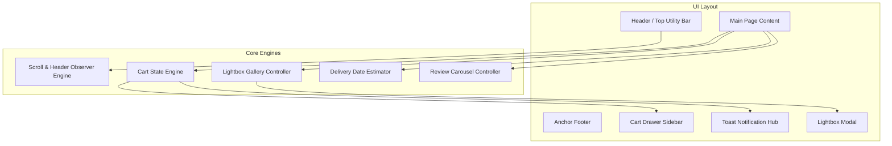
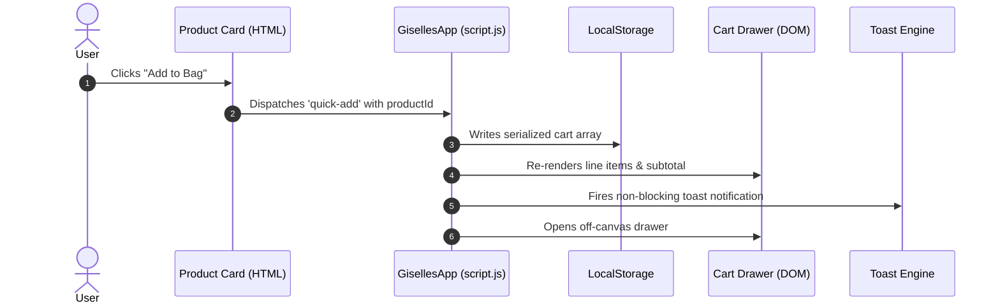

# Technical Architecture: Giselle's Concept

This document outlines the software engineering principles, component hierarchies, state management patterns, and design system tokens implemented across **Giselle's Concept** (`giselles-concept`).

---

## 1. Architectural Principles

1. **Zero Runtime Overhead**: Built using standard Web Platform APIs (HTML5, CSS3, Vanilla ES6+), eliminating framework bundle sizes, virtual DOM overhead, and compilation pipelines.
2. **Design-Token First**: Visual styles and typography rely entirely on CSS Custom Properties (`:root`), ensuring global visual consistency and ease of re-theming.
3. **Decoupled Event Delegation**: UI triggers communicate through standardized HTML5 `data-*` attributes (`data-action`, `data-product-id`, `data-feature`) intercepted by a single event delegator, separating structure from behavior.
4. **Resilient Offline-First State**: Shopping bag data is cached in `localStorage` with JSON schema verification on deserialization.

---

## 2. Component Hierarchy & Flow



---

## 3. Design System & CSS Token Architecture

Global tokens are centralized in `style.css` under `:root`:

```css
:root {
  /* Color Palette */
  --bg-primary: #F8F4EF;          /* Warm Cream Foundation */
  --bg-secondary: #F2EDE4;        /* Sandstone Section Fill */
  --bg-cta: #FFF3F5;              /* Soft Rose Tint */
  --accent-pink: #F97F9C;         /* Brand Highlight Pink */
  --accent-gold: #B88437;         /* Gastronomy Gold */
  --text-primary: #1C1B18;        /* Off-Black Charcoal */
  --text-secondary: #575249;      /* Muted Mineral Body (WCAG AA) */
  --text-light: #7E786E;          /* Subtle Tertiary Label */

  /* Typographic Tokens */
  --font-serif: 'Cormorant Garamond', Georgia, serif;
  --font-sans: 'Plus Jakarta Sans', -apple-system, sans-serif;

  /* Spacing Scale */
  --section-padding: 12rem 8vw;
  --section-padding-mobile: 7rem 6vw;
  --grid-gap: clamp(2rem, 5vw, 6rem);
  --container-width: 1440px;

  /* Elevations & Radii */
  --card-radius: 24px;
  --btn-radius: 40px;
  --card-shadow: 0 30px 60px -15px rgba(28, 27, 24, 0.04);
  --hover-shadow: 0 45px 90px -15px rgba(28, 27, 24, 0.08);
}
```

### Fluid Typography
Typography scales dynamically between mobile and desktop viewports using CSS `clamp()`:
* **H1 / Hero Titles**: `clamp(2.8rem, 6vw, 6.2rem)`
* **Section Titles**: `clamp(2.2rem, 4.2vw, 3.8rem)`
* **Body Text**: `clamp(0.95rem, 1.2vw, 1.15rem)`

---

## 4. State Lifecycle & Data Management

The shopping cart state follows an immutable update pattern backed by browser storage:



---

## 5. Responsive Breakpoint Strategy

| Viewport Category | Max Width | Architectural Adjustments |
| :--- | :--- | :--- |
| **Wide Desktop** | `> 1440px` | Centered layout bounded by `--container-width` (1440px) |
| **Standard Laptop** | `1200px - 1440px` | Proportional fluid padding (`8vw`) |
| **Tablet Landscape** | `992px - 1199px` | Section padding reduced to `10rem 6vw`, top bar concealed |
| **Tablet Portrait** | `768px - 991px` | Product grid collapses to 1-column, mobile menu drawer activated |
| **Mobile Handset** | `< 767px` | Hero padding `12vh 4vw`, vertical button stacking, full-width cart drawer |
