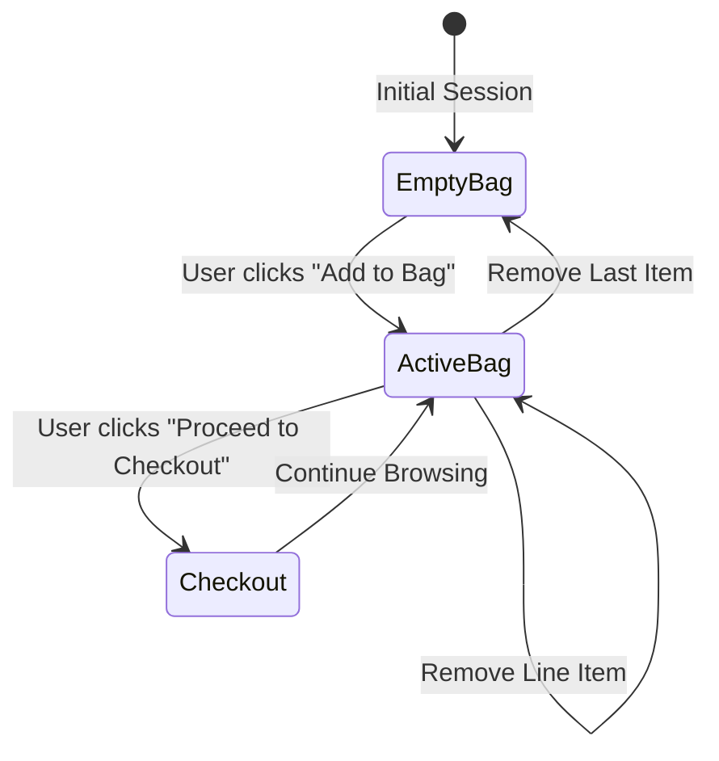

# User Experience & Customer Journey Guide

This document details the functional capabilities, user interactions, and e-commerce workflows implemented across **Giselle's Concept**.

---

## 1. Storefront & Lookbook Experience (`index.html`)

### 1.1 Dynamic Scroll-Linked Navigation
* **Dual Header State**: The navigation header sits transparently over the dark fullscreen lookbook hero initially. When the user scrolls past 40px, the header smoothly transitions into an opaque glassmorphic white surface (`backdrop-filter: blur(24px)`).
* **Logo Scroll Reveal**: On the homepage, the centered SVG logo mark in the hero automatically fades out at 25% viewport scroll threshold, appearing simultaneously in the top sticky navigation bar to maximize content viewability.
* **Mobile Drawer Navigation**: Viewports under 991px feature an accessible hamburger button that animates into an "X" and slides in a full-height navigation panel. Pressing the `Escape` key automatically closes the menu.

### 1.2 Interactive Ingredients Ledger
* **Functional Accordion**: Users can click any of the 3 signature ingredient cards (*Raw Criollo Cacao*, *Sprouted Almonds*, *Coconut Blossom Nectar*).
* **Visual Synchrony**: Expanding an ingredient card triggers a subtle scale-pulse on the accompanying high-resolution ingredient photography, providing immediate visual feedback.

### 1.3 Editorial Reviews Carousel
* **Auto-Play & Manual Control**: The review quote slider rotates through curated press citations (*Vogue*, *Forbes*, *Erewhon*) every 7 seconds.
* **Dot Navigation**: Users can manually select any dot indicator to jump directly to a quote, resetting the autoplay timer.

---

## 2. Product Customization & Detail Workflow (`product.html`)

### 2.1 Fullscreen Pastry Texture Lightbox
* **Zoom Interaction**: Clicking any image in the vertical product gallery stack triggers an accessible modal overlay with a dark scrim (`backdrop-filter: blur(15px)`).
* **Keyboard Navigation**:
  * `Escape`: Closes the lightbox and restores background scroll.
  * `←` (Left Arrow): Displays previous image.
  * `→` (Right Arrow): Displays next image.

### 2.2 Conversion-Focused Subscription Selector
* **Frequency Toggling**: Customers can select between **"Subscribe & Save 15%"** (Rs. 23,885) and **"One-Time Purchase"** (Rs. 28,100).
* **Dynamic Pricing State**: Toggling the radio option immediately updates the display price label, subtitle badge, and sets the item identifier in the cart engine.

### 2.3 Real-Time Delivery Date Estimator
* **Logic Calculation**:
  * Orders placed inside California ship in 2 business days.
  * Orders placed outside California ship in 3 business days.
  * Factoring in the 11:00 AM PST bakery order cut-off: Orders placed after 11:00 AM PST automatically add 1 business day.
* **Formatted Output**: Outputs localized dates (e.g. *"Estimated arrival date: Thursday, Aug 20"*).

### 2.4 Multi-Stage "Add to Bag" Micro-Interaction
* Clicking **"Add to Bag"** executes a 3-stage loading sequence:
  1. *Loading Spinner* (600ms) prevents duplicate clicks.
  2. *Success Checkmark* (300ms) confirms cart registration.
  3. *Sliding Drawer Reveal* (automatic) opens the cart drawer displaying the updated subtotal.

---

## 3. Shopping Bag State & Operations (`script.js`)

* **Quantity Selectors**: Bounded increment and decrement buttons prevent negative or zero order amounts.
* **Subtotal Engine**: Calculates item prices against unit quantities in real time.
* **Persistence**: Refreshing or navigating between `index.html` and `product.html` retains all items via `localStorage.getItem('giselles_cart')`.
* **Toast Notification Engine**: Non-blocking toast notifications appear at the bottom-right corner for shopping actions, newsletter subscriptions, and feature previews.
